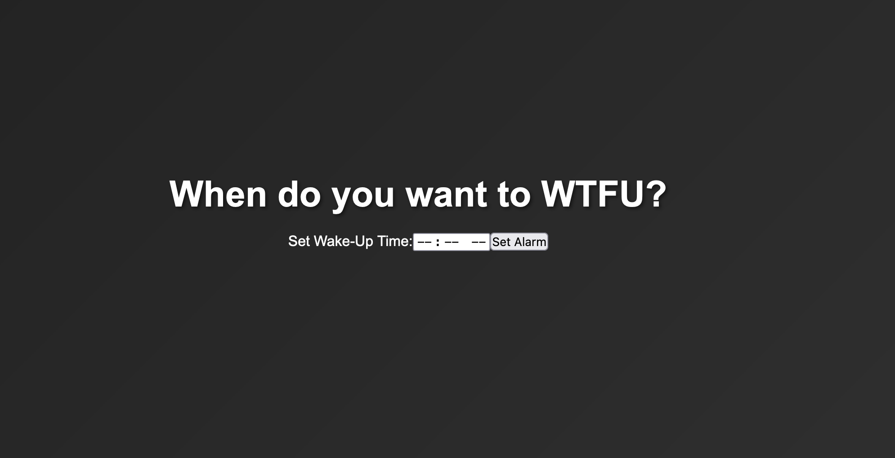
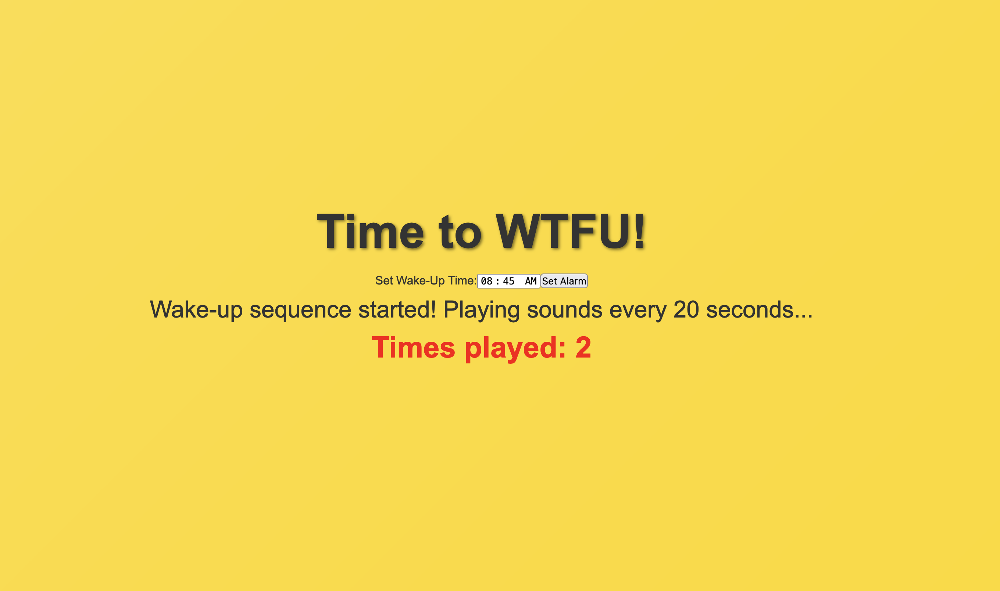

# WTFU Wake-Up Alarm App

A web app built in React to help you wake up on time by playing random loud sounds at a set time, repeating every 20 seconds until you wake up. The app will display a countdown to the set wake-up time and tracks how many times the alarm has played to motivate you to get up!

## Features

- Set a custom wake-up time and start a countdown.
- Plays random alarm sounds every 20 seconds once the wake-up time is reached.
- Continues playing sounds until you close the app.
- Displays how many times the alarm has played to "embarrass" you until you wake up.
- Responsive, full-screen UI with a dark theme, which brightens up when the alarm goes off.

## Demo





## Technologies Used

- **React** - Frontend library
- **JavaScript** - Core language for app logic
- **HTML/CSS** - Structure and styling

## Setup and Installation

To run this app locally, follow these steps:

1. **Clone the repository**:

   ```bash
   git clone https://github.com/your-username/wtfu-wake-up-app.git
   cd wtfu-wake-up-app

```

2. Install dependencies:
```bash
npm install
```

3. Add sound files:

- In the `src/sounds/` folder, add multiple `.mp3` sound files to be used as alarms.
- Update `src/sounds.js` to import and export your sound files.

4. Run the app:

```bash
npm start
```

The app should now be running at <http://localhost:3000>.

## Usage

- Set Wake-Up Time: Enter your desired wake-up time and press "Set Alarm."
- Countdown: The app will show a countdown to your wake-up time.
- Alarm Sequence: Once the wake-up time is reached, the app will start playing sounds every 20 seconds.
- Embarrassment Counter: Track how many times the alarm has played to keep you accountable!
- Stop the Alarm: To stop the alarm, close the app.

## File Structure

```
./
├── public/                  # Public assets
├── src/
│   ├── components/          # React components
│   │   └── AlarmForm.js     # Form component for setting the alarm
│   ├── sounds/              # Folder for sound files (add your own sounds here)
│   ├── App.js               # Main app logic
│   ├── App.css              # Styling
│   └── sounds.js            # Sound imports and exports
├── .gitignore
├── package.json
└── README.md
```

## Customization

- Sounds: Add more sounds to the `src/sounds/` directory and import them in `src/sounds.js`.
- Styling: Modify `src/App.css` to adjust the theme or component sizes.

## Future Enhancements

- Add additional sound categories or allow users to upload their own.
- Create a mobile app version.
- Integrate user authentication to save alarm settings.

## Contributing

If you'd like to contribute, please fork the repository and make a pull request with any changes. Suggestions and feedback are welcome!

## License

This project is licensed under the MIT License.
